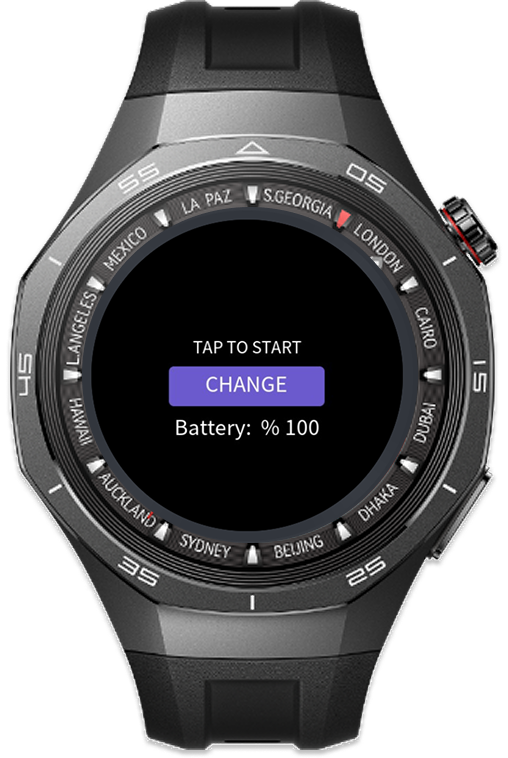
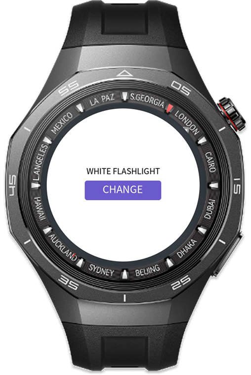
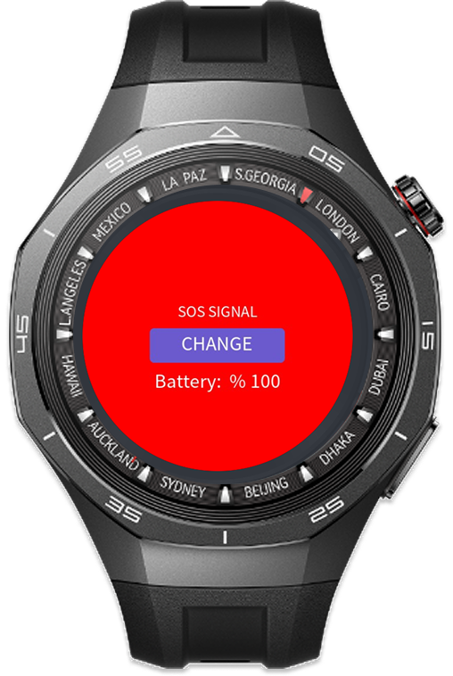

> **Note:** To access all shared projects, get information about environment setup, and view other guides, please visit [Explore-In-HMOS-Wearable Index](https://github.com/Explore-In-HMOS-Wearable/hmos-index).

# flash-blink

App for generating flashlight and flashblink from watch

# Preview

<div>    
  
  
  
</div> 

# Use Cases
Use for enlighting an area or emergency flashblink

# Technology
## Stack
- **Languages**: JS, html
- **Frameworks**: HarmonyOS SDK 5.1.0(18)
- **Tools**: DevEco Studio Vers 5.1.0.842
- **Libraries**:
    - @system.brightness
    - @system.battery
## Required Permissions
- No permission required


# Directory Structure

````
├───AppScope
│   └───resources
│       └───base
│           ├───element
│           └───media
├───entry
│   └───src
│       ├───main
│       │   ├───js
│       │   │   ├───MainAbility
│       │   │   │    └───i18n
│       │   │   │    │     └───en-US.json
│       │   │   │    │     └───zh-CN.json
│       │   │   │    └───pages
│       │   │   │    │     └───index
│       │   │   │    │          └───index.html
│       │   │   │    │          └───index.js
│       │   │   │    │          └───index.css
│       │   │   │    └───app.js
│       │   └───resources
│       │       │     ├───base
│       │       │     └───element
│       │       │     │       └─── string.json
│       │       │     └───media
│       │       │     │   └──icon.png
│       │       │     │   └──icon_small.png
│       │       │     ├───rawfile
````

# Constraints and Restrictions
## Suported Devices

Huawei Sport (Lite) Watch GT 4/5/6
Huawei Sport (Lite) GT4/5 Pro
Huawei Sport (Lite) Fit 3/4
Huawei Sport (Lite) D2
Huawei Sport (Lite) Ultimate

# LICENSE

FlashBlink is distributed under the terms of the MIT License.
See the [LICENSE](/LICENSE) for more information.

